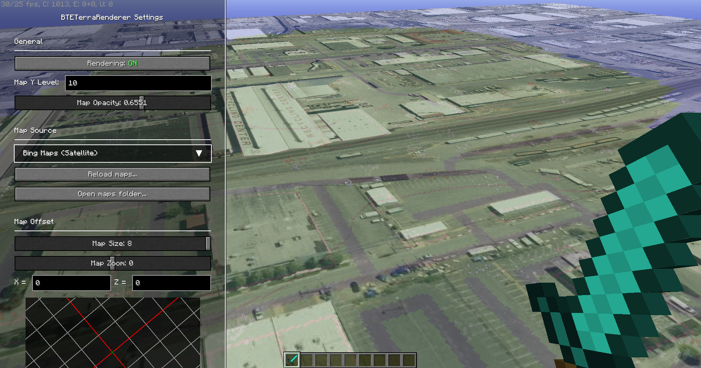

# BTETerraRenderer
 [](https://discord.gg/4gjrwWH2gS)

A map hologram rendering tool for the BuildTheEarth project.<br>
Use this mod to easily map accurate road details and building tops.

Logo by [vicrobex](https://github.com/vicrobex)


## Supported maps

* Global
  * [OpenStreetMap](http://openstreetmap.org/)
  * [Bing maps](https://www.bing.com/maps/)
  * [Yandex.Maps](https://yandex.com/maps/)
* (And many others)

You can add other map services by adding/editing configuration files.<br>
See [API Documentation](YML_CONFIG.md) for more information.

## How to use

1. [Download](https://github.com/tf2mandeokyi/BTETerraRenderer/releases) the latest version of the mod
2. Put the mod in the `mods` folder
   1. Open Minecraft Launcher and go to the `Installations` tab
   2. Find the installation profile, hover your mouse on it, and click the folder icon
   3. The `mods` folder is there
3. Run Minecraft

## Controls

| Key               | Description                                   |
|-------------------|-----------------------------------------------|
| `` ` ``(Backtick) | Opens render settings UI                      |
| `R`               | Toggles map rendering                         |
| `Y`               | Moves map up along the Y-axis by 0.5 blocks   |
| `I`               | Moves map down along the Y-axis by 0.5 blocks | 

## Screenshot



## Development

### How to build

```bash
# You must run this before building other subprojects
./gradlew :core:build

# Building for specific MC versions:
./gradlew :fabric1.18.2:build

# Building for all available MC versions:
./gradlew copyBuildResultToRoot
```

After building for MC versions you can find the jar files in `build/libs` directory.